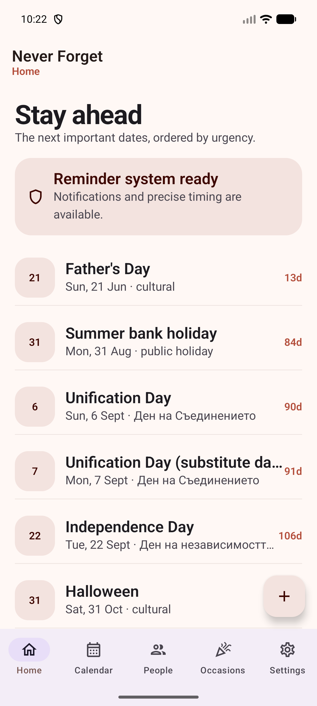
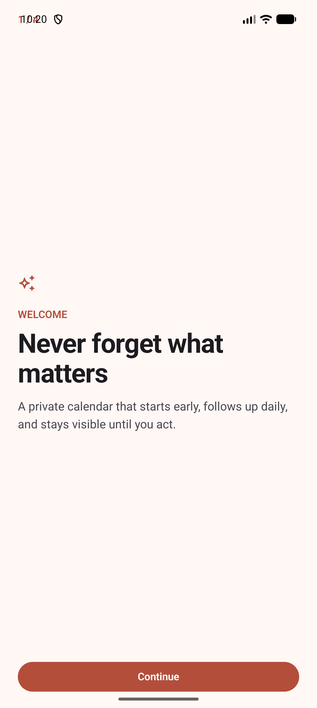
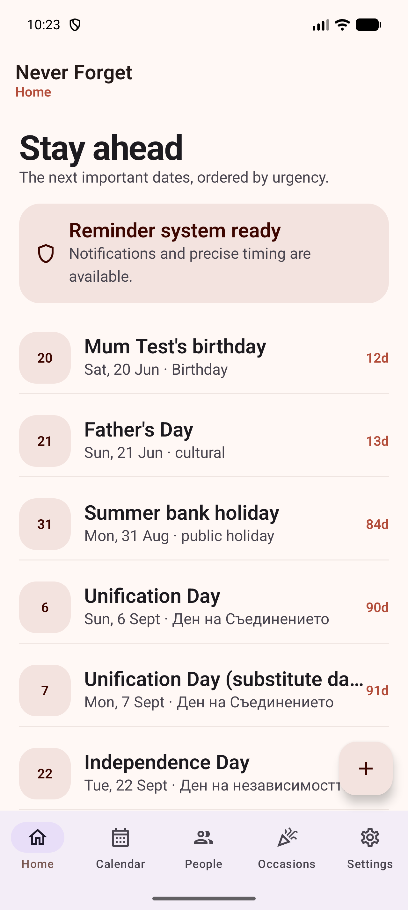

# Never Forget

[](https://github.com/TheFadGhost/never-forget/actions/workflows/android.yml)
[](LICENSE)
[](https://developer.android.com/)
[](PRIVACY.md)

An offline Android calendar that starts reminding early and keeps going until you act.

Never Forget is designed for birthdays, family dates, appointments, tasks, and major occasions that passive calendars make too easy to miss. It stores everything locally, schedules reminders through Android, and can move data through encrypted backups, CSV, or standard `.ics` calendar files.



## Why It Exists

Most calendars notify once, near the event, and then disappear into notification history. Never Forget treats important dates as an active responsibility:

- Start days or weeks early.
- Escalate as the event gets closer.
- Stay visible until completed or snoozed.
- Track practical actions such as gift bought or plans made.
- Work without an account, backend, analytics SDK, or internet permission.

## Features

- Persistent reminder windows with daily, twice-daily, and event-day escalation
- Notification actions for Done, Snooze, Gift bought, and Plans made
- Birthdays with relationship labels, optional birth year, and automatic age
- Events, reminders, tasks, anniversaries, and memorial dates
- UK regional bank holidays and major occasions
- Bulgarian public holidays, Orthodox Easter rules, and curated Name Days
- Contact and Android calendar one-time import
- Standard `.ics` calendar import and export with duplicate detection
- Password-encrypted backup and restore
- People CSV import and export
- Home-screen widget and six visual themes

## Screenshots

<p>
  
  
  
</p>

All screenshots use bundled public occasion data or fake sample records.

## Reminder Policy

The default reminder policy begins at each event's configured lead time:

- Once daily at 09:00
- Twice daily at 09:00 and 19:00 for the final three days
- Every two hours from 09:00 through 21:00 on the event day
- Ongoing high-priority notifications until completed or snoozed

Android notification and exact-alarm permissions are required for the strongest delivery. Some manufacturers also require auto-start and unrestricted battery settings.

## Privacy

The app has no account, analytics, advertising, remote configuration, or backend. Contact and calendar permissions are used only for imports started by the user.

The Android manifest does not request internet access. See [PRIVACY.md](PRIVACY.md) and [SECURITY.md](SECURITY.md).

## Build

Requirements:

- Android Studio with Android SDK 36
- JDK 17

```bash
./gradlew test lintDebug assembleDebug
```

Windows:

```powershell
.\gradlew.bat test lintDebug assembleDebug
```

The debug APK is written to `app/build/outputs/apk/debug/app-debug.apk`.

## Architecture

| Module | Responsibility |
| --- | --- |
| `app` | Compose UI, onboarding, imports, backup, settings, and widget |
| `core:calendar` | Gregorian and Orthodox date rules |
| `core:data` | Versioned country packs and source metadata |
| `core:database` | Room entities, DAOs, and schema |
| `core:reminders` | AlarmManager scheduling, notifications, receivers, and repair |
| `core:designsystem` | Themes and typography |
| `core:model` | Shared domain values |

Calendar source provenance is documented in [docs/CALENDAR_SOURCES.md](docs/CALENDAR_SOURCES.md).

## Contributing

Contributions are welcome, especially for reminder reliability, accessibility, authoritative country packs, translations, and calendar interoperability.

Read [CONTRIBUTING.md](CONTRIBUTING.md), the [code of conduct](CODE_OF_CONDUCT.md), and the [roadmap](docs/ROADMAP.md) before starting a large change.

## License

Never Forget is available under the [MIT License](LICENSE).
